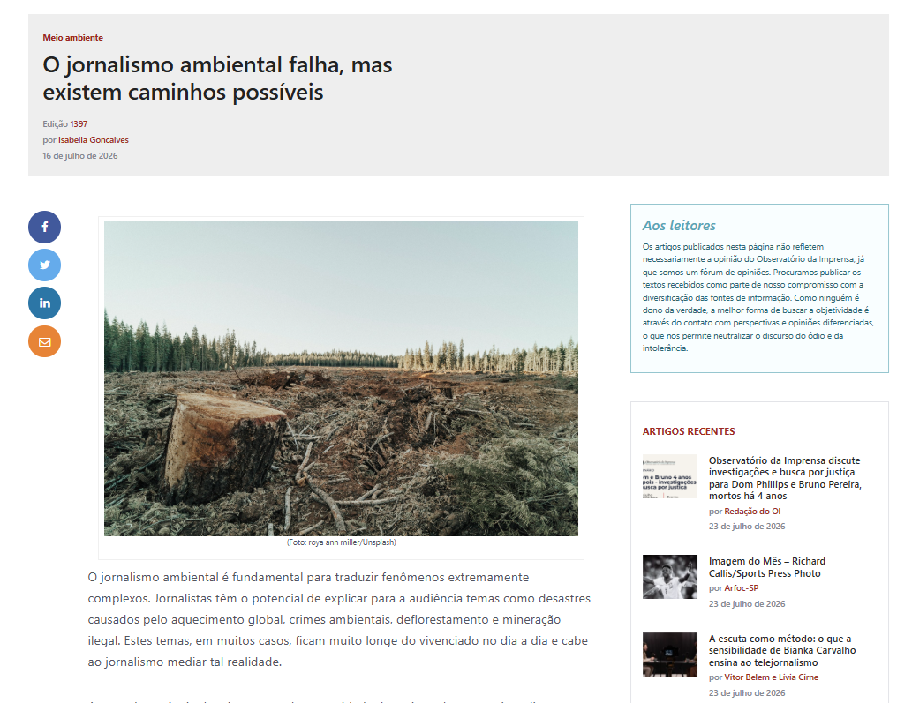

```{=html}
<style>
/* Container do player com margem só embaixo */
.podcast-embed{
  max-width:660px;
  margin: 0 auto 1rem;
}
/* Referências com hanging indent (estilo APA) */
.apa-list p{
  margin: 0 0 .6rem 0;
  padding-left: 1.6rem;
  text-indent: -1.6rem;
}
.apa-list a{
  text-decoration: none;
}
</style>
```

<p align="center">
  
</p>


::: callout-note
[<i class="bi bi-journal-text"></i> Read full media article here](https://www.observatoriodaimprensa.com.br/meio-ambiente-2/o-jornalismo-ambiental-falha-mas-existem-caminhos-possiveis/)

:::

::: {.callout-tip}
## Article based on a published research paper:

Visualizing the Amazon: Data-Driven Storytelling, Mapping and Audience for Environmental Journalism

By Isabella Gonçalves & Mathias-Felipe de-Lima-Santos

[<i class="bi bi-journal-text"></i> Open Access](https://doi.org/10.1177/10776990261462529){.btn .btn-outline-secondary .btn-sm target="_blank" rel="noopener"}

:::
