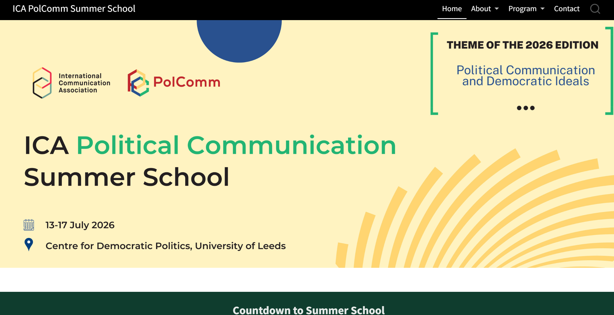

[The ICA Political Communication Summer School](https://polcomm.github.io/summer-school/) is a flagship program that brings together outstanding PhD students and early-career researchers from around the world for an immersive week of training and mentoring. Featuring prominent political communication scholars from around the globe, the Summer School offers participants an intensive week of learning in master classes, engaging in small-group discussions, and receiving feedback on their research. Across the programme, participants engage with cutting-edge debates and methods in this fast-moving field and receive detailed guidance on their own projects through structured consultations, discussant feedback, and informal conversations with faculty. While the 2026 theme is “Political Communication and Democratic Ideals,” we warmly welcome applications from researchers working on any aspect of political communication, and we look forward to hosting the cohort in the inspiring collegiate setting of Devonshire Hall at the University of Leeds (UK).

::: callout-note
## My role in Development:

I developed the website using Quarto and designed the banners and social media templates. 

:::

  

